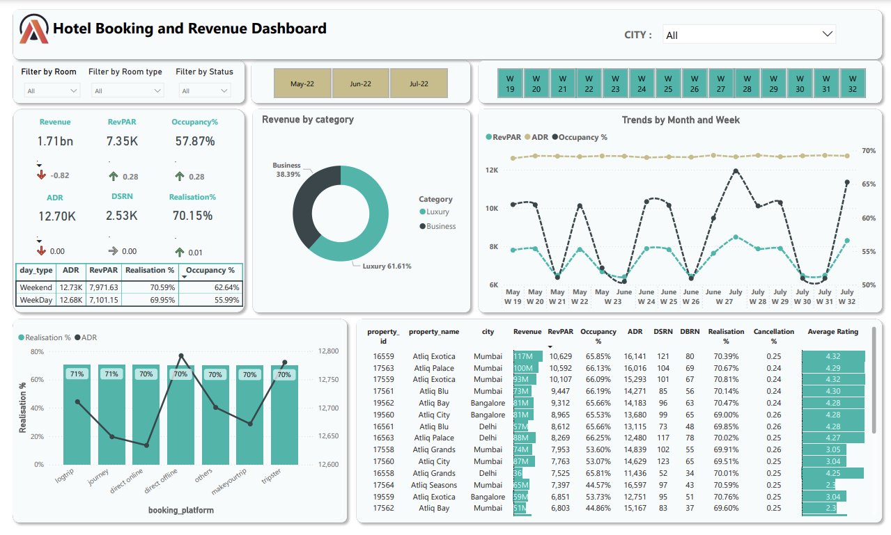

<!DOCTYPE html>
<html lang="en">
<head>
    <meta charset="UTF-8">
    <meta name="viewport" content="width=device-width, initial-scale=1.0">
</head>
<body>
    <h1>Hotel Revenue Dashboard</h1>
    
Welcome to my Power BI dashboard for visualizing hotel revenue data. Here's how I created it:

  <h2>Steps to Create the Hotel Revenue Dashboard</h2>
    <ol>
        <li><strong>Prepare the dataset:</strong>
            
First, I made sure my dataset included the necessary fields: Date, Room Type, Revenue, Rooms Available, and Rooms Occupied. I cleaned and formatted the data to make it ready for analysis.

        </li>
        <li><strong>Open Power BI Desktop:</strong>
            
I opened Power BI Desktop. If you don't have it, you can download and install it from the official Power BI website.

        </li>
        <li><strong>Load the data:</strong>
            
I clicked on 'Get Data', chose the data source (CSV in my case), and loaded the dataset into Power BI.

        </li>
        <li><strong>Transform the data:</strong>
            
Next, I went to 'Home' > 'Transform data' to clean and prepare the data. This step is crucial to ensure the data is suitable for creating visuals.

        </li>
        <li><strong>Create visuals:</strong>
            
I started dragging and dropping fields onto the report canvas to create visuals. I focused on key performance indicators like total revenue, ADR, RevPAR, and occupancy rate.

        </li>
        <li><strong>Add filters and slicers:</strong>
            
I added filters and slicers to allow dynamic filtering of the data by date range, room type, and other dimensions. This made the dashboard interactive.

        </li>
        <li><strong>Design the dashboard:</strong>
            
I arranged the visuals in a logical layout and used formatting options to make the dashboard visually appealing and easy to read.

        </li>
      
        <li><strong>Save and publish:</strong>
            
Finally, I saved the report. To share it, I clicked 'Publish' in Power BI Desktop to publish the dashboard to the Power BI service.

        </li>
       <h2 id="contact">Contact</h2>
    
For any inquiries or feedback, please contact:

    <ul>
        <li><strong>Name:</strong> Rohit Rabi Das</li>
        <li><strong>Email:</strong> <a href="mailto:das201706@gmail.com">das201706@gmail.com</a></li>
        <li><strong>GitHub:</strong> <a href="https://github.com/Rohit-64">Rohit-64</a></li>
    </ul>
  </ol>
</body>
</html>

